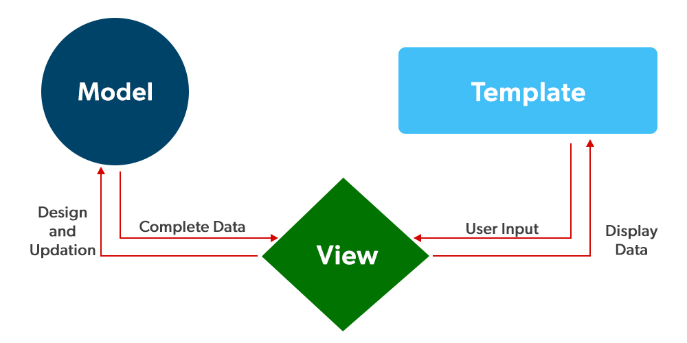

* Jelaskan bagaimana cara kamu mengimplementasikan checklist di atas secara step-by-step (bukan hanya sekadar mengikuti tutorial).
  1. Membuat sebuah projek Django baru 
  Menjalankan command `django-admin startproject light-cones`
    
  2. Membuat aplikasi dengan nama main pada proyek tersebut 
  Menjalankan command `django-admin startapp main`
    
  3. Melakukan routing pada proyek agar dapat menjalankan aplikasi main 
  Menambahkan view baru untuk path `main` pada `urls.py` serta menambahkan `main` ke dalam `INSTALLED_APPS` pada `settings.py`
    
  4. Membuat model pada aplikasi main dengan nama Item dan memiliki atribut wajib 
  membuat class baru yang inherit dari class `Models` dengan property `name`, `amount`, dan `descriptions` pada `models.py`
    
  5. Membuat sebuah fungsi pada views.py untuk dikembalikan ke dalam sebuah template HTML yang menampilkan nama aplikasi serta nama dan kelas kamu. 
  Membuat fungsi dengan nama `show_main` parameter request yang melakukan render file html untuk dikirimkan kepada client sebagai HTTP response
    

* Buatlah bagan yang berisi request client ke web aplikasi berbasis Django beserta responnya dan jelaskan pada bagan tersebut kaitan antara urls.py, views.py, models.py, dan berkas html.
  

  
Pertama, request datang dari client menuju Django server. Django server mencocokkan View yang cocok untuk request tersebut. View kemudian mengambil data dari Model dan HTML template dari Template. Data yang didapat dari Model kemudian dimasukkan ke dalam Template, sehingga HTML template sekarang sudah berisi data yang relevan untuk request tersebut. Template tersebut kemudian diforward ke View untuk kemudian dikirimkan kembali kepada client sebagai response.
  

* Jelaskan mengapa kita menggunakan <strong><i>virtual environment?</i></strong> Apakah kita tetap dapat membuat aplikasi web berbasis Django tanpa menggunakan <strong><i>virtual environment?</i></strong>
  
Virtual environment berfungsi untuk mengisolasi package-package Python yang digunakan pada sebuah projek tertentu. Virtual environment melakukan isolasi package dengan cara membuat package yang terinstall pada sebuah projek tidak dapat diakses oleh projek lain selain projek tersebut. Dengan adanya virtual environment, setiap projek dapat mempunyai kombinasi package yang berbeda, bahkan dengan versi yang berbeda pula tergantung kebutuhan developer.  

* Jelaskan apakah itu MVC, MVT, MVVM dan perbedaan dari ketiganya.
  
MVC, MVT, dan MVVM merupakan architectural design yang menjelaskan bahwa sebuah aplikasi dapat dibagi menjadi 3 bagian berdasarkan fungsionalitasnya.
  
Pada Model-View-Controller (MVC), model merupakan bagian dari aplikasi yang menghandle segala hal yang berkaitan dengan data, seperti read/write data. View merupakan bagian dari aplikasi yang menghandle tampilan apa yang akan ditampilkan kepada user. Controller merupakan bagian dari aplikasi yang berfungsi sebagai penengah antara model dan view. Controller juga menerima request dan memproses request dan bekerja sama dengan model untuk melakukan read/write data serta view untuk menampilkan data yang data yang diambil dari model untuk ditampilkan kembali kepada user sebagai response.
  
Model-View-Template (MVT) merupakan sebuah variasi dari MVC yang menjadi architectural design dari framework Django. Pada MVT, model masih menjadi bagian yang menghandle read/write data, serta view menghandle tampilan manakah yang akan ditampilkan kepada user. Akan tetapi, bagian controller dihandle oleh framework, sehingga developer tidak perlu lagi mengimplementasi bagian controller.
  
Pada Model-View-ViewModel (MVVM), fungsionalitas view mirip dengan view pada MVT, yaitu sebagai bagian yang menghandle request dan response. Akan tetapi, tugas view disini adalah untuk mengirimkan events kepada ViewModel untuk memproses request yang datang dan mengembalikan response kepada client melalui View.