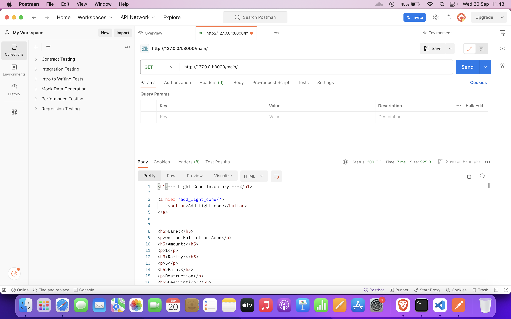
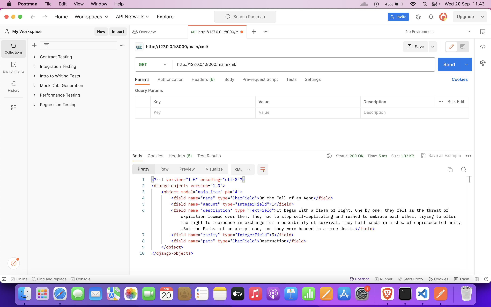
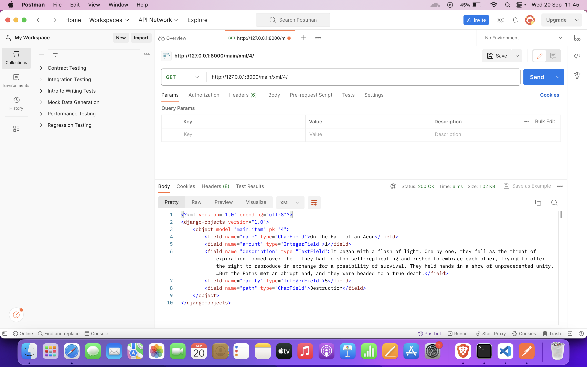
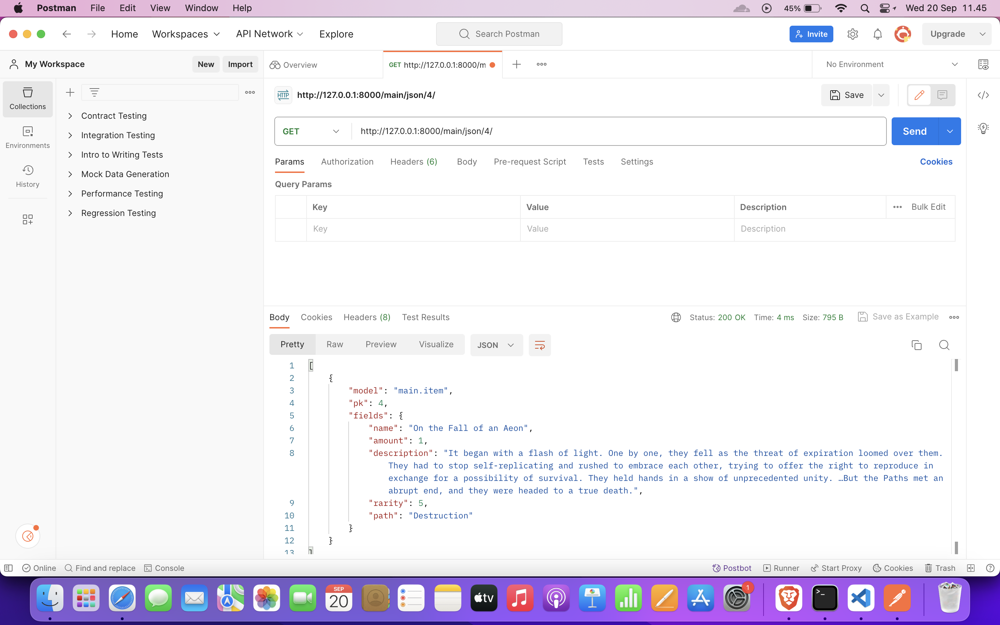

- Apa perbedaan antara form POST dan form GET pada Django?
    
  GET request merupakan method HTTP yang biasa digunakan untuk mengambil data yang tersedia pada server tanpa mengubah data pada server. Pada GET request, parameter request ditambahkan ke URL tempat resource berada.
    
  Di sisi lain, POST request merupakan method HTTP yang biasa digunakan untuk memodifikasi atau menambahkan data yang ada pada server. Pada POST request, parameter request ditambahkan ke bagian body dari request tersebut.

  

- Apa perbedaan utama antara XML, JSON, dan HTML dalam konteks pengiriman data?
    
  HTML merupakan bahasa markup yang secara khusus digunakan untuk menampilkan data terstruktur pada web page, sedangkan XML dan JSON digunakan untuk penyimpanan dan pertukaran data di internet.

  

- Mengapa JSON sering digunakan dalam pertukaran data antara aplikasi web modern?
    
  Ada beberapa hal yang membuat JSON sering digunakan dalam pertukaran data. File dengan format JSON biasanya lebih kecil daripada file dengan format pertukaran data lain seperti XML untuk data yang sama. Selain itu, sintaks JSON yang mirip dengan sintaks object pada JavaScript membuat JSON terasa lebih familiar format lain seperti XML.

  

- Jelaskan bagaimana cara kamu mengimplementasikan checklist di atas secara step-by-step (bukan hanya sekadar mengikuti tutorial).
    

  1. Membuat input form untuk menambahkan objek model pada app sebelumnya.
       
     Pertama, saya membuat template baru bernama `add_light_cone.html`. Kemudian, saya menambahkan tag form HTML dengan method POST. Di dalam tag form HTML, saya menambahkan beberapa tag input HTML untuk meminta input dari user. Terakhir, saya menambahkan button pada bagian bawah untuk mengirimkan hasil form ke path `/main/add_light_cone` menggunakan POST request.
       
  2. Tambahkan 5 fungsi views untuk melihat objek yang sudah ditambahkan dalam format HTML, XML, JSON, XML by ID, dan JSON by ID.
       
     Untuk fungsi view yang menampilkan objek dalam format HTML, saya menambahkan sebuah view bernama `show_main`. View tersebut akan melakukan render `main.html` dengan menambahkan semua objek Item yang ada untuk kemudian dikirimkan kepada client.
       
     Untuk fungsi view yang menampilkan objek dalam format XML, saya menambahkan dua view bernama `show_xml` dan `show_xml_by_id`. Kedua view tersebut mengembalikan response berupa semua objek Item yang sudah di-parse menjadi format XML untuk kemudian dikirimkan kepada client melalui HTTP response. Khusus untuk view `show_xml_by_id`, view tersebut akan menerima request pada path `xml/<angka>`, berbeda dengan view `show_xml` yang menerima request pada path `xml/` saja. View `show_xml_by_id` juga akan mengembalikan response dalam format XML mirip dengan view `show_xml`, bedanya view `show_xml_by_id` hanya akan menampilkan data pada urutan yang disebutkan pada `<angka>`.
       
     Untuk fungsi view yang menampilkan objek dalam format JSON, saya menambahkan dua view bernama `show_json` dan `show_json_by_id`. Berbeda dengan view yang menerima request XML, `show_json` menerima request pada path `json/` dan mengembalikan response berupa semua objek Item yang ada dalam format JSON. View `show_json_by_id` menerima request pada path `json/<angka>` dan mengembalikan response berupa sebuah objek Item yang diminta pada urutan yang disebutkan pada `<angka>`
       
  3. Membuat routing URL untuk masing-masing views yang telah ditambahkan pada poin 2.
       
     Pertama, saya menambahkan path `add_light_cone/`, `xml/`, `json/`, `xml/<int>`, dan `json/<int>` ke `urls.py` pada direktori main. Kemudian, saya menambahkan path `/main/` ke `urls.py` pada direktori light_cones. Dengan melakukan kedua hal tersebut, path `/main/`, `/main/add_light_cone/`, `/main/xml/`, `/main/json/`, `main/xml/<int>`, `main/json/<int>` dapat diakses oleh client.

 

- HTML
    
  

    

- XML
    
  

    

- XML with ID
    
  

    

- JSON with ID
    
  
